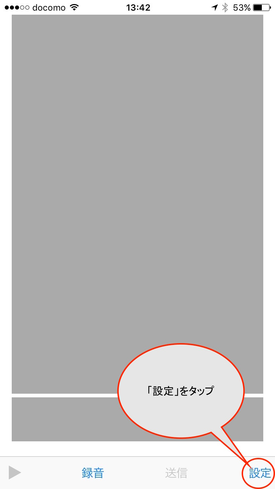
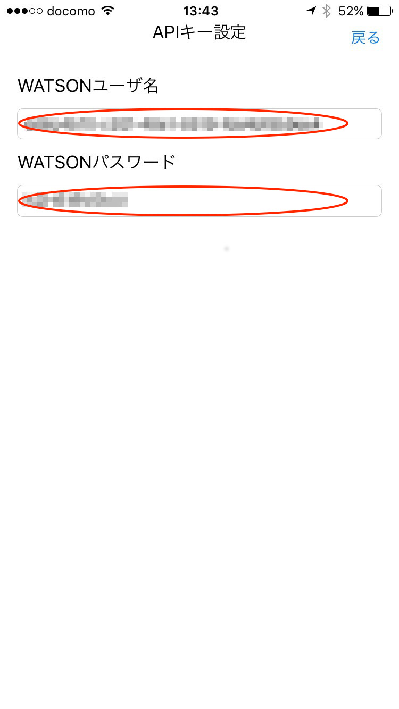
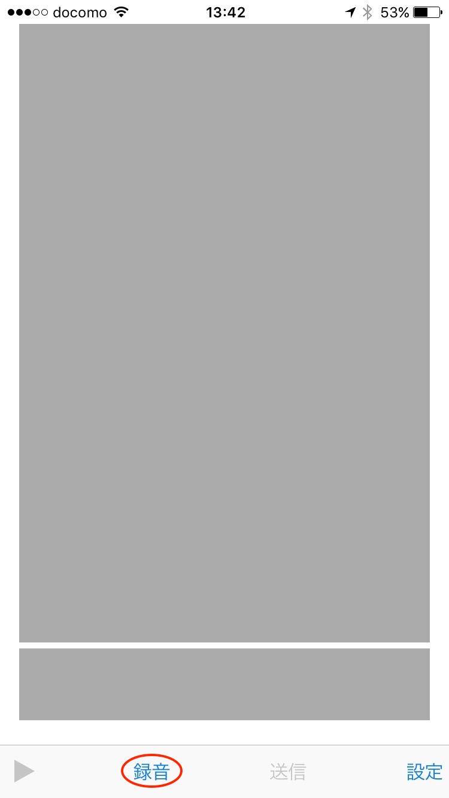
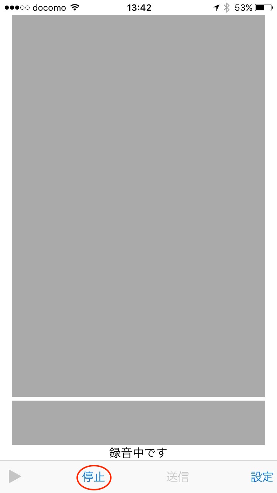
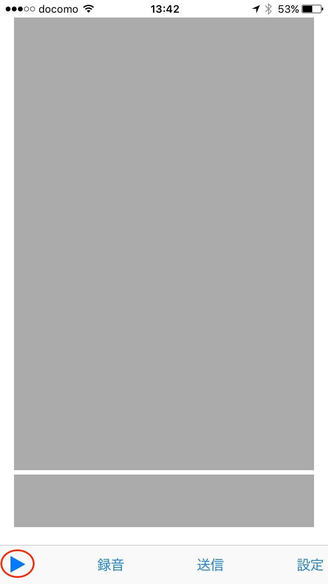
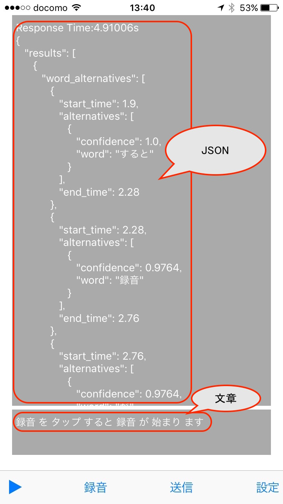

# WATSON_speech_to_text_Tester
IBMからリリースされている音声認識API 「Watson Speech To Text」 (https://www.ibm.com/smarterplanet/us/en/ibmwatson/developercloud/speech-to-text.html) を簡単に試すことができるiOSアプリです。(日本語にのみ対応しています)

## 使い方
### ビルド
Xcodeでプロジェクトを開き、ビルドします

### ユーザ名・パスワードの取得
1. パソコンでIBM Bluemixのコンソール(https://console.ng.bluemix.net/) にログインします。
  (右上の「ログイン」をクリックするとログイン画面に移動します)
1. 「カタログ」をクリックします
1. 左側のリストにある、「Watson」のチェックをつけると右側のエリアに「Speech To Text」が出て来るのでクリックリックします。
1. 右側の「サービスの追加」欄の「作成」ボタンをクリックします。（「スペース」がない場合は作成する必要があります）
1. しばらく待つとSpeech To Textの管理画面に移動します。
1. 左側の「サービス資格情報」をクリックします。
1. 右側の「資格情報の追加」をクリックするとユーザ名とパスワード、APIのアクセス先URLががJSON形式で表示されます。"username","password"に相当する文字列をアプリで使用します。

### ユーザ名・パスワードの設定
1. アプリを開き「設定」をタップします
 
1. 設定画面が開くので取得したユーザ名とパスワードを入力し、「完了」をタップします。
 

### 録音して音声をWATSONに送信
1. 「録音」をタップすると録音が始まります。（「録音」が「停止」に変わり、「録音中です」と表示されます）
 
1. 適当な音声をマイクから録音して下さい。録音が終わったら「停止」をタップします。
 
1. ▷をタップすると録音した音声を確認できます。
 
1. 「送信」をタップすると録音した音声がWATSONに送信されます。（「APIに送信中です」と表示されます）
 
1. しばらく待つとAPIの認識結果がグレーのエリアに表示されます。（上がWATSONが返してきたJSON、下が認識結果の文章です）
 

## 参考
### Speech To Text の概要
http://www.ibm.com/smarterplanet/us/en/ibmwatson/developercloud/speech-to-text.html
### Speech To Text デモページ
https://speech-to-text-demo.mybluemix.net/
### Speech To Text APIリファレンス
https://www.ibm.com/smarterplanet/us/en/ibmwatson/developercloud/speech-to-text/api/v1/#introduction
