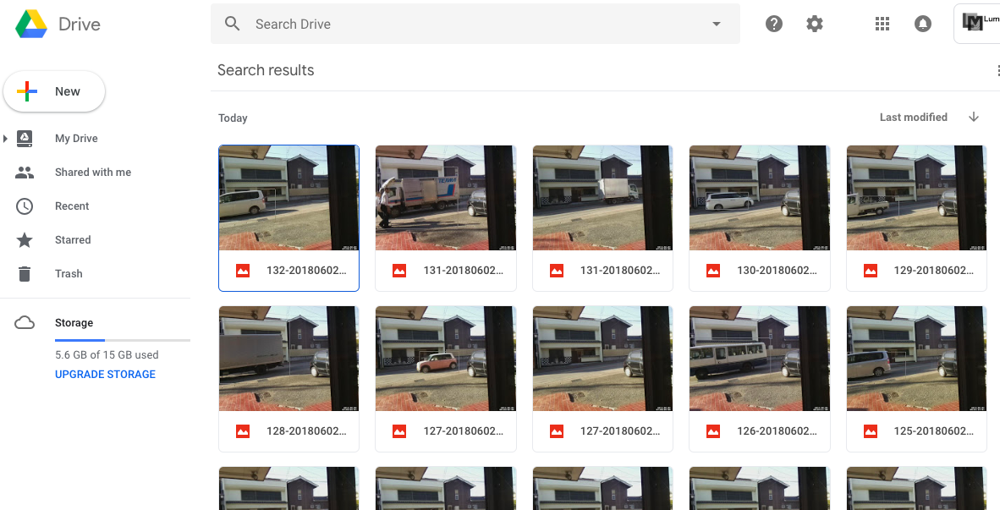

# Motion
RaspberryPiのカメラを使って動体検知を行い、撮影された画像をGoogle Driveに蓄積するデモです。
motionのバージョンは4.0-1を想定しています。

```
sudo apt -y install motion
```

`/etc/modules` に以下の行を追加します。

```
bcm2835-v4l2
```

`/etc/defaults/motion` を編集してデーモンを有効化します。

```
start_motion_daemon=yes
```

`/etc/motion/motion.conf` の下記の設定を修正します。

```
width 640
height 480
event_gap 10
output_pictures best
ffmpeg_output_movies off
snapshot_interval 1800
locate_motion_mode on
```

修正内容は以下のようになります。他のパラメタも必要に応じて適宜調整してください。

- 画像サイズを640x480に(320x240)
- 動体を検知し続ける長さを10秒に(60秒)
- 検知中に最も動きのあったフレームのみ保存(on:全て保存)
- 検知中のムービー保管を無効化(有効)
- 30分に1回スナップショットを保存(保存なし)
- 動体を検知した範囲を矩形で囲む(囲まない)

設定を完了したらRaspberryPiを再起動します。
`/var/lib/motion` に画像(jpg)が蓄積され始めたら正常に動作しています。

## GoogleDriveに画像を転送する

必要なライブラリをインストールします。
```
sudo apt -y install python3-pip
sudo pip3 install --upgrade httplib2 oauth2client google-api-python-client
```

[Drive API クイックスタート](https://developers.google.com/drive/v3/web/quickstart/python)の
手順を参考に関連づけたいGoogleアカウントの `client_secret.json` を入手してください。

`motion-googledrive.py` と `client_secret.json` を以下のようにpiユーザの`bin`
ディレクトリに配置します。

```
scp bin/motion-googledrive.py pi@raspberrypi.local:bin/motion-googledrive.py
scp client_secret.json pi@raspberrypi.local:bin/motion-googledrive-secret.json
```

初回のみcredentialを取得するための手続きが必要です。以下のコマンドを実行して表示された
URLにアクセスし、そこで得られたトークンを（続けて表示されている）プロンプトに貼り付けてください。
`pictures-test` がDrive上に作成されるフォルダの名前になります。任意の文字列に変更可能です。
`%f` は送信する画像ファイルのプレースホルダですが、%fのまま指定することで、初期化の動作をします。

```
sudo -u motion python3 /home/pi/bin/motion-googledrive.py --noauth_local_webserver pictures-test %f
```

この時に、Google Drive上に指定した名前のフォルダ(`pictures-test`)が生成されていれば接続成功です。

`/etc/motion/motion.conf` の下記の設定を修正します（フォルダ名は上記で設定したものと合わせてください）。

```
on_picture_save python3 /home/pi/bin/motion-googledrive.py pictures-test %f
```

デーモンを再起動し、画像がDrive上に届くことを確認してください。

```
sudo service motion restart
```



## 古い画像を削除する
画像は `/var/lib/motion` に蓄積されているので、適宜削除タスクを定義します。
同ディレクトリ内の `.credentials` を削除してしまわないよう留意してください。

上記スクリプトの第2引数に「%d」を指定することで、Drive上に保存されている画像のうち
30日以上経過したものを削除します。日数を変更したい場合はスクリプトを直接編集してください。
スターが付けられた画像はスキップされます。

```
0 1 * * * sudo find /var/lib/motion/ -mtime +1 -name "*.jpg" -delete
0 2 * * * python3 /home/pi/bin/motion-googledrive.py pictures-test \%d
```

## 再認証する
半年ほど、問題なく稼働していましたが、何らかのきっかけでGoogleDrive側の認証がとれてしまうことがあるようです。セットアップ時のコマンド(--noauth_local_webserver)を再度実行して認証をやり直してください。
